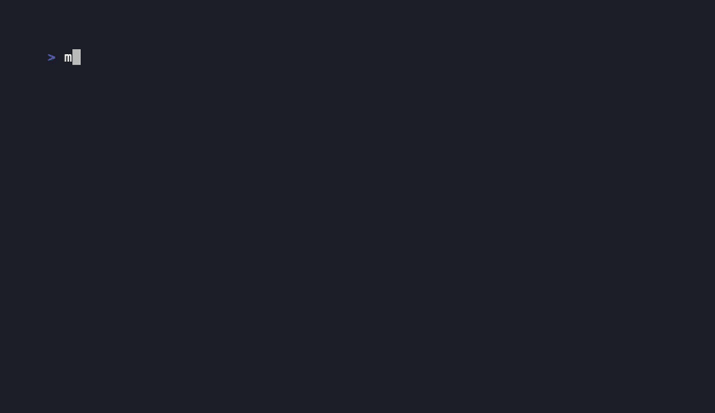

# Minorag — Local Codebase RAG for Developers

Minorag is a lightweight, offline-friendly RAG CLI that indexes your codebase, computes embeddings locally (via Ollama), and lets you ask natural-language questions about your source code.

- Fully local (no cloud calls)
- Fast SQLite embedding store
- Multi-repository indexing
- Natural language Q&A using your local LLM
- No telemetry, no tracking

Think *ripgrep + ChatGPT*, but fully offline.

---

## Demo



---

# Features

- Local embeddings via Ollama (mxbai-embed-large, nomic-embed-text, etc.)
- Local chat answering using any Ollama chat model
- Chunk-based indexing for multi-language repos
- Cosine similarity search
- Pretty CLI output (Spectre.Console)
- Zero network requirements beyond Ollama
- Simple .NET global tool installation

---

# Prerequisites

## 1. Install Ollama

Minorag requires **Ollama** for embeddings and LLM chat.

👉 **Download / learn more:** https://ollama.com


Install Ollama with a shell script:

```bash
curl -fsSL https://ollama.com/install.sh | sh
```

Start Ollama:

```bash
ollama serve
```

## 2. Pull recommended models

```bash
ollama pull mxbai-embed-large
ollama pull gpt-oss:20b
```

---

# Installation

## Pack the .NET tool

```bash
dotnet pack -c Release
```

## Install globally

From inside `src/`:

```bash
dotnet tool install --global Minorag.Cli --add-source ./Minorag.Cli/bin/Release
```

## Uninstall

```bash
dotnet tool uninstall --global minorag.cli
```

---

# Configuration

Minorag automatically loads:

- `appsettings.json`
- `appsettings.local.json`
- Environment variables with prefix `MINORAG_`

Example `appsettings.json`:

```json
{
  "Ollama": {
    "Host": "http://127.0.0.1:11434",
    "EmbeddingModel": "mxbai-embed-large",
    "ChatModel": "gpt-oss:20b",
    "Temperature": 0.1
  },
  "Database": {
    "Path": "~/.minorag/index.db"
  }
}
```

---

# Usage

## Index the current repo

```bash
minorag index
```

Index a specific folder:

```bash
minorag index --repo ~/dev/project
```

## Ask questions

```bash
minorag ask "Where is the authentication handled?"
```

## Print the database path

```bash
minorag db-path
```

---

# Why Minorag?

| Feature | Minorag | VS Code Extensions | Cloud ChatGPT | Cody |
|--------|---------|--------------------|----------------|------|
| Fully local | ✔ | ✖ | ✖ | ✖ |
| Offline | ✔ | ✖ | ✖ | ✖ |
| Multi-repo RAG | ✔ | ✖ | ✖ | ✔ |
| Customizable models | ✔ | ✖ | ✖ | ✖ |
| No telemetry | ✔ | ✖ | ✖ | ✖ |

Minorag is ideal for:

- Developers who **cannot upload code to the cloud**
- Private/internal repos
- Offline environments
- DevOps workflows (CI/CD assistants)
- Laptops with local LLM setup (Ollama, LM Studio, etc.)

---

# Roadmap

- [ ] Additional embedding providers
- [ ] Additional LLM chat clients (OpenAI, LM Studio, LocalAI)
- [ ] Web UI for browsing + RAG chat
- [ ] Language-aware symbol extraction
- [ ] Multi-threaded indexing
- [ ] Automatic repo discovery

---

# Contributing

1. Fork repo  
2. Create feature branch  
3. Submit PR  
4. Get a virtual high-five 🎉

---

## Triggering new release pipeline

```bash
./tag-release.sh
```

---

## License

This project is licensed under the **Apache License 2.0**.

You may:

- Use the code commercially  
- Modify and distribute it  
- Build derivative works  
- File issues and contribute  

Under the condition that you retain:

- The LICENSE file  
- The NOTICE file  
- Copyright attribution  

See the full license text in the [LICENSE](LICENSE) file.